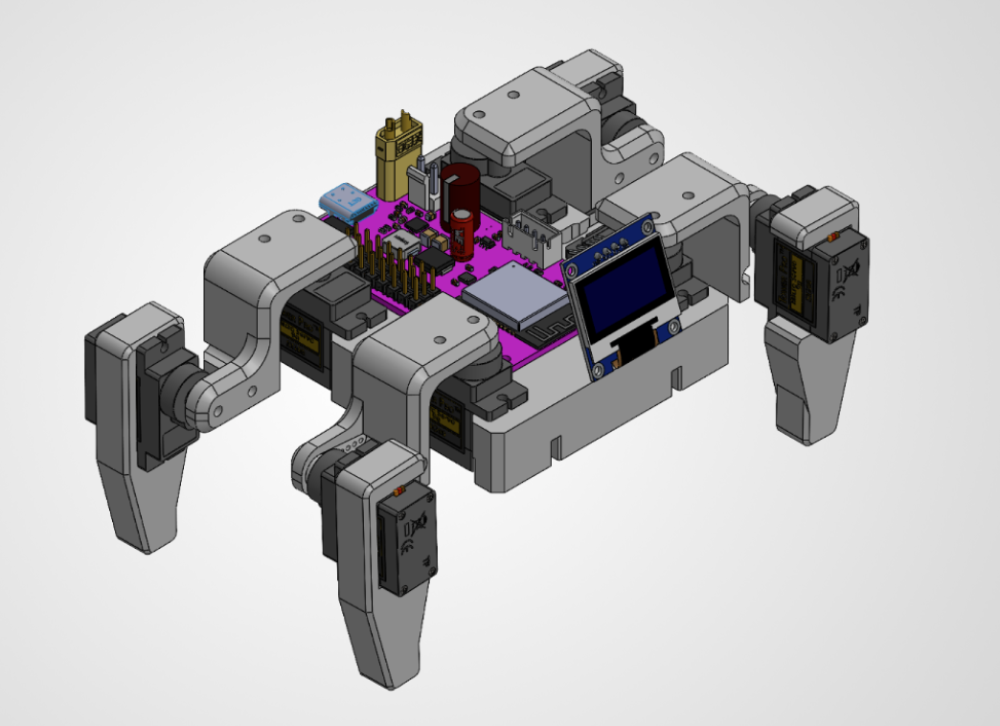

# Hermit Crab 🦀

A WiFi-controlled quadruped walking robot built from scratch — custom 3D-printed chassis, PCB, and ESP32 firmware driving 8 servo leg joints with an OLED face. The long-term goal is an autonomous platform with computer-vision-guided motion planning, built up through multiple hardware and firmware iterations.

<p align="center">
  
</p>

## Project Structure

```
hermit-crab/
├── firmware/                       
|    ├── main/      # Main ESP32 firmware project
|    └── tests/     # Standalone bring-up sketches (servo calibration, WiFi AP)
|
└── hardware/
    ├── cad/        # Chassis and leg CAD models
    └── pcb/
        ├── drc/    # Design Rule Check for JLC PCB manufacturer
        ├── v1/     # Version 1 board files
        └── v2/     # Version 2 board files
```

- **Firmware** — architecture, controls, and calibration are documented in [`firmware/README.md`](firmware/README.md)
- **Hardware** — component selection and power-system design documented in [`hardware/pcb/Hermit_Hardware_Design.pdf`](hardware/pcb/Hermit_Hardware_Design.pdf)
- **PCB v1** — complete; documented in [`hardware/pcb/v1/README.md`](hardware/pcb/v1/README.md)
- **PCB v2** — in progress; documented in [`hardware/pcb/v2/README.md`](hardware/pcb/v2/README.md)

🎬 **[Watch the video demo of firmware testing](https://youtu.be/UnXPqfklwHU)**
