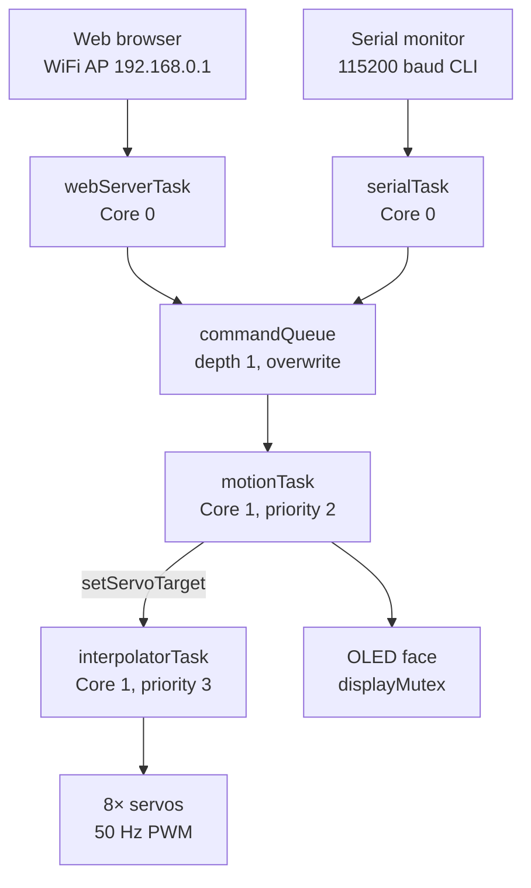

# Hermit Crab — Firmware

ESP32 firmware for the Hermit Crab quadruped: C++ (Arduino framework) on FreeRTOS, with a fully data-driven motion engine.

## Hardware Interface

What the firmware expects to be wired up:

| Peripheral | Config |
|---|---|
| Servos | 8× MG90D on pins 13, 14, 23, 16, 17, 18, 19, 33 — order: R1 R2 L1 L2 R4 R3 L3 L4 |
| OLED | SSD1306 128×64 over I2C (SDA 21 / SCL 22, addr `0x3C`) |
| WiFi | AP mode, SSID `HermitCrab`, UI at `http://192.168.0.1` |
| Serial | 115200 baud CLI |

**NOTE:** The MG90D's full 500–2500 µs pulse range spans 270° of travel. The firmware attaches the servos at 833–2167 µs, trimming ~333 µs per side so that the code's 0–180° range maps onto the physically centered 180° of the servo. Keyframes also stay in the 0–180 units and the extreme ends of travel are never commanded.

## Architecture

Four FreeRTOS tasks across both cores. Commands from any source funnel through a single depth-1 queue (`xQueueOverwrite` — newest command always wins), and all physical servo motion flows through one interpolator task.



| Task | Core | Priority | Job |
|---|---|---|---|
| `webServerTask` | 0 | 1 | Serves the web UI, parses `/cmd`, `/motor`, `/status` |
| `serialTask` | 0 | 1 | Serial CLI: movements, direct motor control, subtrim |
| `motionTask` | 1 | 2 | The state machine — plays sequences by setting servo targets |
| `interpolatorTask` | 1 | 3 | 50 Hz tick that glides every servo toward its target at a capped speed |

### Single-Owner Servo Model

There is no servo mutex, by design. `servoTarget[]` may be written from any task via `setServoTarget()`, but **servo hardware is written only by `interpolatorTask`** — the single owner. Poses and gaits never touch the hardware; they declare where servos should *end up*, and the interpolator moves them there at up to `servoMaxSpeed` (600 deg/s default), producing smooth motion and eliminating write races structurally instead of locking around them.

The one exception is boot: `setServoImmediate()` snaps all servos to 90° once, staggered 5 ms apart to spread inrush current, before any task exists.

### Data-Driven Motion

Every movement is a table of `Keyframe`s — 8 target angles (or `NC` = "no change") plus a duration — wrapped in a `Sequence` with playback flags:

```cpp
static const Keyframe WAVE_FRAMES[] = {
  //  R1   R2   L1   L2   R4   R3   L3   L4    ms
  { {135,  45,  45, 135,   0, 180,   0, 180}, 200 },  // stand
  { {170,  NC,  NC, 165,  NC,  NC,  NC,  NC}, 250 },  // shift weight back-right
  ...
};
const Sequence SEQ_WAVE = { WAVE_FRAMES, FRAME_COUNT(WAVE_FRAMES), 3, 4, false, true, false };
```

Sequence flags control playback: `loopStart`/`repeatCount` replay a section, `isGait` marks continuous held-state cycles (walking, turning), `standAtEnd` glides back to the stand posture when finished (used by one-shot poses), and `sticky` parks in the state after completion (used by static poses). Two generic engines (`playPose`, `playGaitCycle`) play everything; a lookup table maps states to sequences.

**Adding a new movement** touches four data tables and zero functions: a state in the `MovementState` enum, a frames array + `Sequence` in `movement-sequences.cpp`, a row in `SEQUENCE_TABLE`, a row in `COMMAND_TABLE`, and a row in `FACE_TABLE`.

### Interruption and Safety

Animations poll the command queue *inside* their frame delays (`interruptibleDelay` for poses, `pressingCheck` for gaits), so a new command preempts mid-animation instead of waiting for the sequence to finish. Aborted gaits recover gracefully to the stand posture.

The web D-pad drives gaits as **held** commands: the browser re-sends the command every 200 ms while the button is held, and a firmware hold watchdog (`HOLD_TIMEOUT_MS`, 600 ms) stops the robot if refreshes stop arriving — a closed browser, a dropped WiFi link, or a finger sliding off the button can't leave the robot walking into a wall. The web UI adds its own layers: pointer capture so release always registers, plus auto-stop when the tab is hidden or loses focus. Serial gait commands are not held and run until `stop`.

## Controls

### Web UI

Connect to the `HermitCrab` WiFi access point and open `http://192.168.0.1`. The interface has a hold-to-drive D-pad, a stop button, one-tap pose buttons, and per-servo sliders for direct motor control.

### Serial CLI (115200 baud)

```
rest, stand, walk, back, left, right,     movement & pose commands
wave, dance, swim, point, pushup, bow,
cute, freaky, worm, shake, shrug,
dead, crab, stop

<m> <angle>        direct motor (e.g. "3 90")
all <angle>        all motors at once
subtrim            show trim values
subtrim <m> <v>    trim motor m by v degrees (-90..+90)
subtrim reset      zero all trims
subtrim save       print a code line to paste back into the sketch
```

### HTTP API

| Endpoint | Description |
|---|---|
| `GET /cmd?c=<command>` | Any command string from the table above |
| `GET /motor?i=<0-7>&a=<0-180>` | Direct motor write |
| `GET /status` | JSON state + live servo positions |

`/status` returns live interpolated positions, intended as the hook for future scripting and the Raspberry Pi / ROS 2 bridge:

```json
{"state":7,"name":"wave","pos":[135,45,45,135,0,180,0,80]}
```

## Calibration

Mechanical assembly never puts every leg segment at a perfect neutral, so each servo has a **subtrim** offset applied at hardware-write time. The workflow: run the robot, adjust live over serial (`subtrim 3 -4`), then `subtrim save` prints the `servoSubtrim[8]` initializer to paste into the sketch permanently.

## Directory Layout

```
main/
├── main.ino                    Tasks, state machine, interpolator, web/serial handlers
├── movement-sequences.h        Servo layout, state enum, Keyframe/Sequence model
├── movement-sequences.cpp      All pose & gait data tables + the playback engines
├── web.h                       The web UI (single self-contained HTML page in PROGMEM)
└── face-bitmaps.h / .cpp       OLED face bitmaps (X-macro list, image2cpp output)

tests/
├── servo/mg90d-servo-test.ino  Standalone sketch for bring-up/calibration of servos
└── wifi/wifi-test.ino          Standalone sketch to verify the ESP32 WiFi AP in isolation
```

## Hardware Status
 
The firmware currently runs on an **ESP32 WROOM-32E dev board** for testing while the custom ESP32-S3 PCB is being built. The pin assignments above reflect the dev board wiring and will change when the firmware moves to the S3 board.
 
## Roadmap
 
- Orientation sensing (IMU) once PCB is done
- Forward kinematics for foot-position telemetry over `/status`
- Raspberry Pi 5 + ROS 2 / MoveIt 2 as a high-level planner, with the ESP32 as a real-time joint-space executor
- Camera + computer-vision-guided motion planning