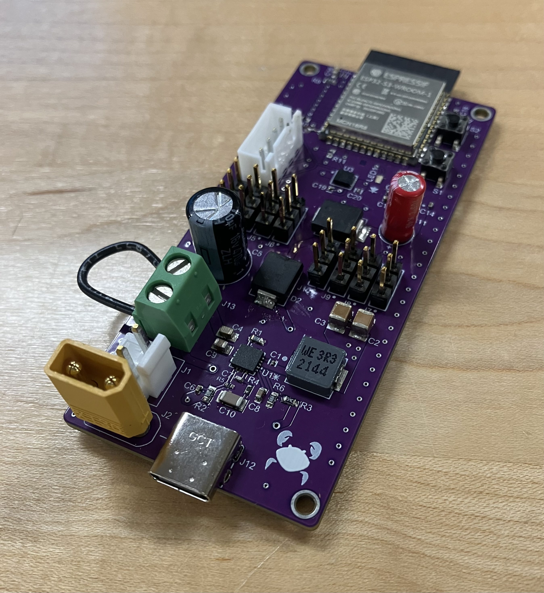

# Hermit V1 PCB

  

Custom 4-layer power and control PCB for the Hermit Crab project, designed in Altium Designer. The board is powered by a 2S LiPo battery and integrates an ESP32-S3 with cascaded 5V buck and 3.3V LDO regulation, IMU and OLED peripherals over I2C, and Schottky diode OR-ing to allow USB-powered development.

## Design Overview

- **MCU:** ESP32-S3
- **Power input:** 2S LiPo battery
- **Regulation:** Cascaded 5V buck converter followed by a 3.3V LDO
- **Peripherals:** IMU and OLED display over I2C
- **USB development support:** Schottky diode OR-ing between battery and USB power rails
- **Layer stackup:** 4 layers

## Version 1 Notes

This is the first revision of the board, built to validate the overall design before committing to further iterations. A large test point (the green block terminal) was included specifically to break out and measure current draw, so the current requirements of the servo motors can be precisely characterized to inform regulator and battery sizing on future revisions.

The bare board was fabricated by JLCPCB. Components were purchased from Digikey (see [BOM](Hermit%20V1_BOM.xlsx)) and hand-assembled/soldered.

## Files

| File | Description |
| --- | --- |
| `Hermit V1_BOM.xlsx` | Bill of materials |
| `Hermit_V1_AssembledPCB.heic` | Photo of the assembled board |
| `Hermit_V1_GerberX2.zip` | Fabrication files |
| `Hermit_V1_Schematic.pdf` | Full schematic |
