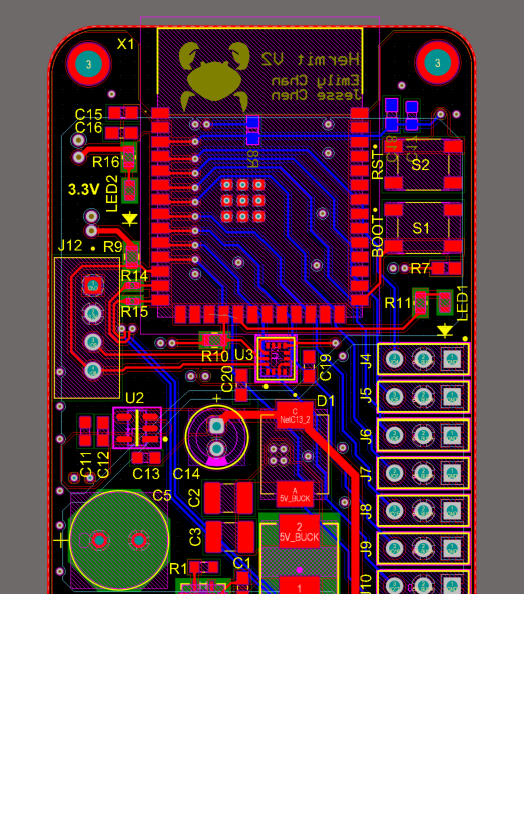
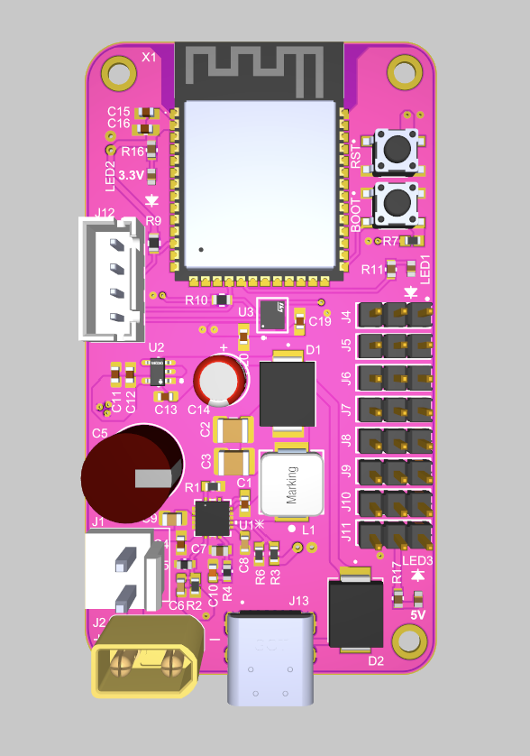

# Hermit V2 PCB

Version 1 successfully validated the core power architecture. The ESP32-S3 operated correctly from both USB and battery power, and the 3.3 V rail reliably powered all I2C peripherals. A temporary block-terminal test point inserted in the battery input path also enabled current consumption measurements, which matched the original design expectations. As a result, no functional changes to the power system were required.

## Changes in V2

- Added power indicator LEDs for immediate visual confirmation of each power rail, eliminating the need to probe with a DMM during bring-up.
- Removed the temporary block-terminal current measurement point used during V1 validation.
- Optimized component placement and routing to reduce the overall PCB footprint.

## Altium Layouts

<table>
  <tr>
    <td align="center">
       
      2D Layout
    </td>
    <td align="center">
       
      3D Layout
    </td>
  </tr>
</table>

